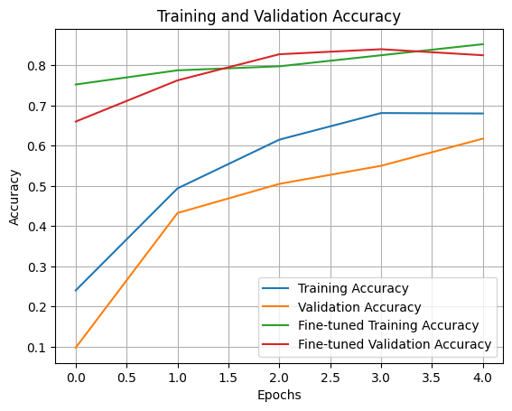
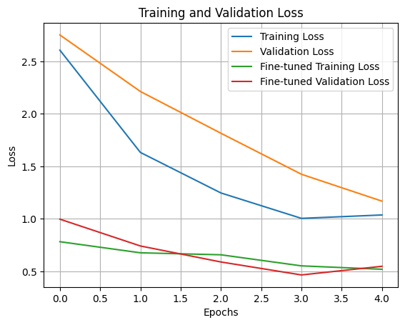
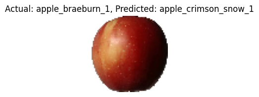
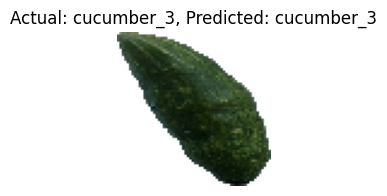
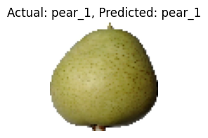

# Fruit Classification with Transfer Learning using VGG16

Classifying images of fruits with pre-trained VGG16 model.

I use transfer learning which helps using a model trained on large dataset on a smaller dataset with fewer data and computational resources. I fine-tune a pre-trained model on custom dataset of fruits images and enable it to classify fruits. The result is a trained model capable of categorizing fruits.

## Steps done in this project

1. Check installation and import required packages.
2. Load the Fruits-360 dataset and organize it into `train`, `val`, and `test` folders.
3. Set up data generators for training, validation, and testing.
4. Define VGG16 as the pre-trained base model.
5. Add custom classification layers on top of VGG16.
6. Compile the model.
7. Train the model with callbacks.
8. Fine-tune the model by unfreezing the last 5 VGG16 layers.
9. Evaluate the model on unseen test data.
10. Visualize training performance and test model prediction.

## Directory structure

`dataset/`
- `train/`
- `val/`
- `test/`

Each subdirectory under `train`, `val`, and `test` contains class folders for the respective fruit category.

## 1-loading data

The notebook downloads and extracts the Fruits-360 original-size dataset, then prepares directory paths for training, validation, and testing.

## 2-import necessary libraries

Main tools used in the notebook:

- `ImageDataGenerator` for loading images and augmentation
- `VGG16` for transfer learning
- `Sequential` for building the model
- `GlobalAveragePooling2D`, `Dense`, `BatchNormalization`, `Dropout` for the custom head
- `ReduceLROnPlateau`, `EarlyStopping` for training control

Packages used:

- `tensorflow`
- `numpy`
- `matplotlib`
- `pandas`
- `scikit-learn`
- `seaborn`
- `pyarrow`
- `requests`
- `scipy`
- `os`
- `subprocess`
- `zipfile`

## 3-set up data generators

It is used for training, testing, validation.

- `train_datagen` applies rescaling and augmentation such as rotation, shift, shear, zoom, and horizontal flip
- `val_datagen` and `test_datagen` only rescale images
- `flow_from_directory` loads images from directory folders with target size `(64, 64)` and batch size `16`

## 4-Define VGG16

Loading the pre-trained model and add custom layers to it.

The model structure is:

- `VGG16(weights='imagenet', include_top=False, input_shape=(64, 64, 3))`
- freeze all base VGG16 layers initially
- `GlobalAveragePooling2D()`
- `Dense(256, activation='relu')`
- `BatchNormalization()`
- `Dropout(0.3)`
- `Dense(num_classes, activation='softmax')`

This structure keeps the strong visual features learned by VGG16 and adds a lightweight classifier head for the fruit classes.

## 5-Compiling the model

The model is compiled with:

- loss: `categorical_crossentropy`
- optimizer: `adam`
- metric: `accuracy`

### Why these choices were used

- `categorical_crossentropy` is appropriate because this is a multi-class classification task with one class per image
- `adam` is a good default optimizer because it adapts learning rates and converges quickly in transfer learning settings
- accuracy is used because the goal is correct class prediction

## 6-Train the model

The initial training phase uses callbacks to monitor validation loss, adjust learning rate, and stop early if needed.

- `ReduceLROnPlateau` reduces the learning rate when validation loss stops improving
- `EarlyStopping` helps prevent overfitting and restores the best weights

Initial training for 5 epochs improved performance from about:

- training accuracy: `0.24 -> 0.68`
- validation accuracy: `0.10 -> 0.62`

## 7-Fine-tuning the model

I unfreeze layers in VGG16 to train the model with those layers.

- unfreeze the last 5 layers of VGG16
- keep BatchNorm layers frozen
- continue training with a very small learning rate: `1e-5`

Fine-tuning improved performance further:

- training accuracy: about `0.75 -> 0.85`
- validation accuracy: about `0.66 -> 0.83`
- peak validation accuracy: about `0.84`

## 8-evaluate the model

Evaluating on unseen data gives:

- test accuracy: about `0.83`

This is a solid result for a 24-class fruit classification task and shows that transfer learning helped the model generalize reasonably well.

## 9-visualize training performance

Plots the training and validation accuracy and loss.

### Accuracy curve

Save this figure as `training-validation-accuracy.png` so it renders correctly in GitHub.

The accuracy plot shows steady improvement during the first training stage, then a clear jump after fine-tuning.  
The validation curve stays close to the training curve, which suggests decent generalization with only mild overfitting.

### Loss curve

Save this figure as `training-validation-loss.png` so it renders correctly in GitHub.

The loss plot decreases strongly in both phases, and the fine-tuned losses are much lower than the initial ones.  
There is a small uptick in validation loss at the very end, which suggests slight overfitting after the best fine-tuned epoch.

## 10-test model prediction

Predicting on test images.

The notebook uses `visualize_prediction`-style logic to load a test image, preprocess it, predict its class, and display the actual and predicted labels.

### Sample prediction 1

Save this figure as `prediction-apple-braeburn.png`.

Actual: `apple_braeburn_1`, Predicted: `apple_crimson_snow_1`.  
This is a reasonable mistake because the two apple classes are visually very similar in shape, color, and texture.

### Sample prediction 2

Save this figure as `prediction-cucumber-3.png`.

Actual: `cucumber_3`, Predicted: `cucumber_3`.  
This is a correct prediction and suggests the model learned strong features for this class.

### Sample prediction 3

Save this figure as `prediction-pear-1.png`.

Actual: `pear_1`, Predicted: `pear_1`.  
This is also a correct prediction and shows that the model can generalize well on some unseen fruit samples.

## Possible issues in prediction of a model

- Class similarity: visually similar fruit classes such as different apple varieties can confuse the model
- Insufficient data: some classes may have fewer useful examples
- Limited training: unfreezing only a few layers may still limit class-specific adaptation

## Files

- `Keras-FruitClassification-TransferLearning.ipynb`
- `README.md`
- `training-validation-accuracy.png`
- `training-validation-loss.png`
- `prediction-apple-braeburn.png`
- `prediction-cucumber-3.png`
- `prediction-pear-1.png`

## Summary

This project uses transfer learning with VGG16 to classify fruit images from the Fruits-360 dataset. It starts with frozen pre-trained features, adds a custom classification head, trains the model, fine-tunes the last 5 VGG16 layers, evaluates on unseen test data, and visualizes both learning curves and sample predictions. The final result is good overall, with about `83%` test accuracy, correct predictions on cucumber and pear examples, and one understandable confusion between two similar apple classes.
